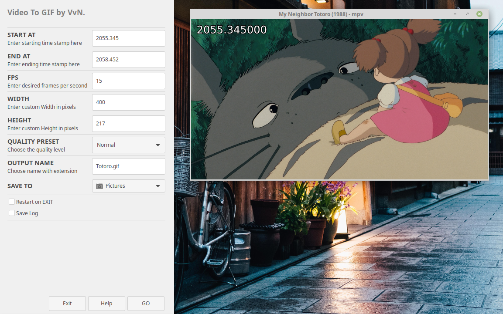

# VTOG
Video to GIF by VvN.

Welcome to VTOG! 

VTOG is a GUI tool that creates GIF's out of video files using FFMPEG for processing and YAD for the main interface. 
There are lots of tools out there that make GIF's out of videos but they usually are just too slow when high bitrate
videos are used, especially on slow computers. With VTOG you can make GIF's out of extremely high bitrate video sources 
as long as the format is supported by FFMPEG, even if you are usign a potato pc like the one used to write this script. 
Its my first script so bear with me.

 
 

*All 4 examples encoded with VTOG at different quality presets and fps.

VTOG uses quality presets to make FFMPEG commands friendly and simple to the end user. VTOG GUI is also focused in this same principle. Under Help button find detailed information of every entry box and setting. I also tried to detail the most I could the VTOGFINAL script to make it easier to understad. Remember that is my first script so is string fiesta.

FFMPEG AND YAD ARE REQUIRED TO RUN VTOG
How to install.
1. Download VTOGv1.tar
2. Extract and open a terminal in the same folder
3. Run command:   $ chmod 755 INSTALL 
4. Run command:   $ ./INSTALL
4. Done!

I want this project to be available for all the distros, but I'am just starting so my knowledge is very limited.
Also english is not main native language so feel free to correct every gramatical error.
Inside VTOG-Notes.txt is the info for time display in VLC and MPV. Also help button have a detailed description of every setting.

How to install VTOG, and how to use it on Video below.

VvN. out
